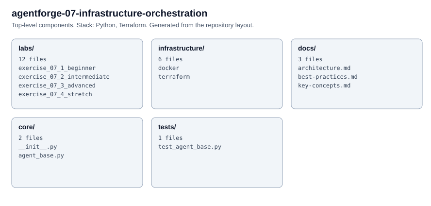

# AgentForge 07 — Infrastructure & Orchestration Agents

  

## Quick Start
```bash
cp .env.example .env && pip install -r requirements.txt
python -m labs.exercise_07_1_beginner.agent
cd infrastructure/terraform/environments/dev && terraform init && terraform plan
```

## Structure
```
├── core/agent_base.py                  # ReAct loop, tool registry, cost tracker
├── labs/exercise_07_*/             # 4 exercises (beginner → stretch)
├── infrastructure/terraform/modules/   # runtime, datastore, gateway
├── infrastructure/docker/Dockerfile    # Multi-stage production image
├── tests/                              # pytest tests
├── .github/workflows/deploy.yml        # lint → test → tf validate
└── docs/                               # Architecture, practices, concepts
```

## Portal & Diagrams
- [Full Curriculum](https://kogunlowo123.github.io/agentforge-portal/)
- [Architecture Diagram](https://kogunlowo123.github.io/agentforge-portal/diagrams/07-infrastructure-orchestration.html)

---
AgentForge v1.0 · MIT · [kogunlowo123](https://github.com/kogunlowo123)

<!-- architecture -->
## Architecture


